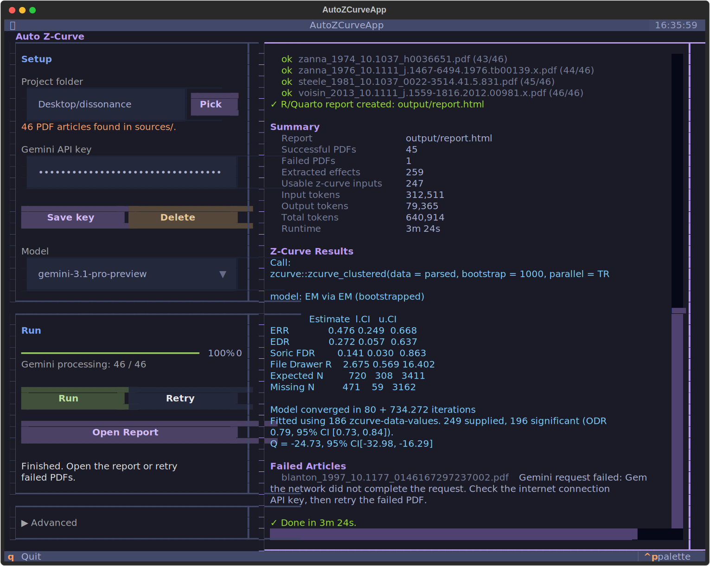

# Auto Z-Curve

Auto Z-Curve reads a folder of PDF articles, uses Google's Gemini AI to extract focal statistical results from each one, and produces a z-curve analysis report — including a plot, summary statistics, and a full disclosure table.

You interact with it through a simple terminal interface: point it at your PDFs, enter your API key, and click Run.



---

## What you'll need

Install these before starting:

| Tool | Where to get it |
|------|-----------------|
| Python 3.9 or later | [python.org/downloads](https://www.python.org/downloads/) |
| R | [cran.r-project.org](https://cran.r-project.org) |
| Quarto | [quarto.org](https://quarto.org/docs/get-started/) |
| A Gemini API key | [aistudio.google.com](https://aistudio.google.com/app/apikey) — free, but you will likely need to upgrade to the paid tier for extensive use |

You'll also need these R packages. Run this once in R:

```r
install.packages(c("zcurve", "dplyr", "jsonlite", "knitr",
                   "readr", "purrr", "tibble", "yaml"))
```

---

## Installation

**Step 1 — Open a terminal**

On **Mac**, this is the Terminal app (iTerm2 is a nicer alternative: [iterm2.com](https://iterm2.com)). On **Windows**, use Command Prompt or PowerShell. Note: Auto Z-Curve has not yet been tested on Windows or Linux.

**Step 2 — Download Auto Z-Curve**

In your terminal, navigate to where you want to install it (e.g. your Documents folder) and run:

```
cd ~/Documents
git clone https://github.com/YOUR-USERNAME/auto-zcurve.git
```

This creates an `auto-zcurve` folder there.

**Step 3 — Install**

```
cd auto-zcurve
pip install -e .
```

This installs the `auto-zcurve` command. You only need to do this once.

> **Getting updates:** when a new version is released, run `git pull` from the `auto-zcurve` folder, then re-run `pip install -e .`.

---

## Getting a Gemini API key

1. Go to [aistudio.google.com/app/apikey](https://aistudio.google.com/app/apikey) and sign in with a Google account
2. Click **Create API key**
3. Copy the key — you'll paste it into Auto Z-Curve when you first run it

Your key is saved locally on your computer only. It is never stored in your project folder or shared anywhere.

---

## Setting up your project folder

Create a folder for your project and put all your PDFs inside a subfolder called `sources`:

```
my-project/
  sources/
    smith-2019.pdf
    jones-2021.pdf
    chen-2023.pdf
```

The folder and PDF names can be anything you like.

---

## Running Auto Z-Curve

Open a terminal and run:

```
auto-zcurve
```

The interface will open in your terminal window.

**First time:**

1. Click **Pick** to choose your project folder, or type its path in the Folder box
2. Paste your Gemini API key into the API key field and click **Save** — this stores it permanently so you won't need to enter it again
3. Choose a model from the dropdown (see [Choosing a model](#choosing-a-model) below)
4. Click **Run**

The right-hand panel shows live progress as each PDF is processed. When finished, click **Open Report** to view your results in a browser.

**Next time**, just open the app, confirm the folder, and click Run — the app remembers your last project.

---

## Choosing a model

| Model | Best for |
|-------|----------|
| **Gemini Flash** | Most articles — faster and cheaper |
| **Gemini Pro** | Complex or ambiguous papers — slower but more accurate |

Your model choice is saved per project, so Retry runs automatically use the same model.

---

## Understanding your outputs

After a run, a new `output/` folder appears inside your project:

| File | What it contains |
|------|-----------------|
| `report.html` | Your z-curve report — open in any browser |
| `disclosure_table.csv` | Every extracted effect with quotes, metadata, and z-curve inputs |
| `extractions.json` | Full Gemini output for each PDF |
| `run_log.csv` | A record of every processing attempt |

The HTML report includes:
- **Z-curve plot** — the distribution of z-values and estimated replication rates
- **Summary statistics** — ERR, EDR, and confidence intervals
- **Disclosure table** — every extracted statistic with the text that supports it
- **Failed articles** — any PDFs that could not be processed

---

## What gets extracted

By default, Auto Z-Curve looks for **focal statistics** — the main result reported in support of each paper's primary claim. These are typically the statistics mentioned in the abstract or highlighted in the results.

On your first run, Auto Z-Curve will offer to copy in a default extraction schema. You can customise this schema later (see [Customising extraction](#customising-extraction)).

---

## If some PDFs fail

Failed articles do not stop the run — they are recorded and shown in the report. Common reasons:

- The PDF is a scanned image (no selectable text)
- The file is very large
- A temporary error from the Gemini API

Once the run finishes, click **Retry** to reprocess only the failed PDFs. You can retry as many times as needed.

---

## Customising extraction

What gets extracted is controlled by a file called `extraction_schema.yml` in your project folder. This file tells Gemini what to look for in each article.

The default schema extracts focal statistics plus supporting metadata (DOI, study description, quotes). You can edit this file to:

- Change which statistics count as focal (e.g. restrict to specific hypotheses)
- Add or remove metadata fields
- Include or exclude specific effect types

Each field in the schema has a `description` that is sent directly to Gemini as an instruction, so plain English descriptions work well.

---

## Configuration

The settings panel inside the app lets you adjust:

| Setting | What it does | Default |
|---------|--------------|---------|
| **Parallel PDFs** | How many PDFs are sent to Gemini at the same time | 10 |
| **Timeout (sec)** | How long to wait for a response before marking a PDF as failed | 600 |
| **Max upload (MB)** | PDFs larger than this are skipped rather than uploaded | 128 |

The defaults work well for most projects. Increasing **Parallel PDFs** speeds up large batches if your Gemini API quota allows it.

---

## Troubleshooting

**"auto-zcurve: command not found"**
The installation didn't complete, or your terminal session needs to be restarted. Try closing and reopening the terminal, then run `pip install -e .` again from the Auto Z-Curve folder.

**"Quarto is missing"**
Download and install Quarto from [quarto.org](https://quarto.org/docs/get-started/), then restart the app.

**"Missing R packages"**
Run the `install.packages(...)` command from the [What you'll need](#what-youll-need) section in R, then try again.

**Gemini API key errors**
Double-check the key at [aistudio.google.com/app/apikey](https://aistudio.google.com/app/apikey). Keys can be regenerated there if needed.

**The report shows no z-curve**
Z-curve requires a minimum number of usable statistics. If the disclosure table shows extractions but no z-curve, there may not be enough statistics that could be converted to z-values, or the statistics may all be non-significant. Check the disclosure table and consider adjusting your extraction schema.
