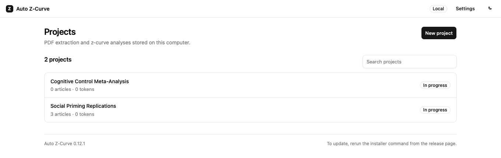
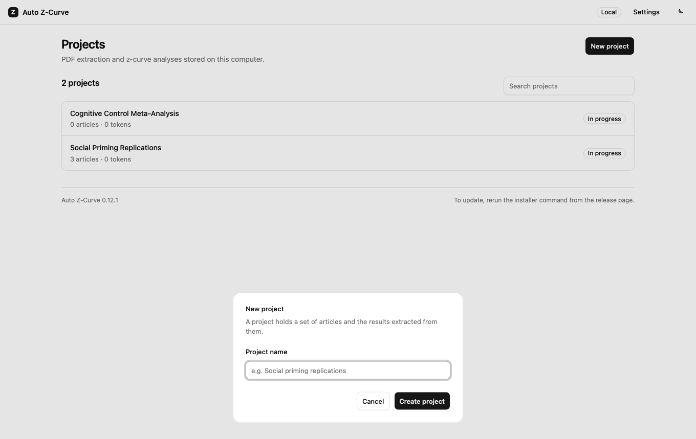
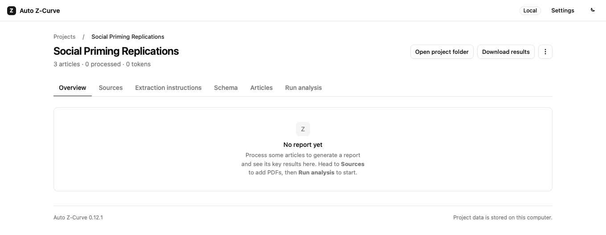
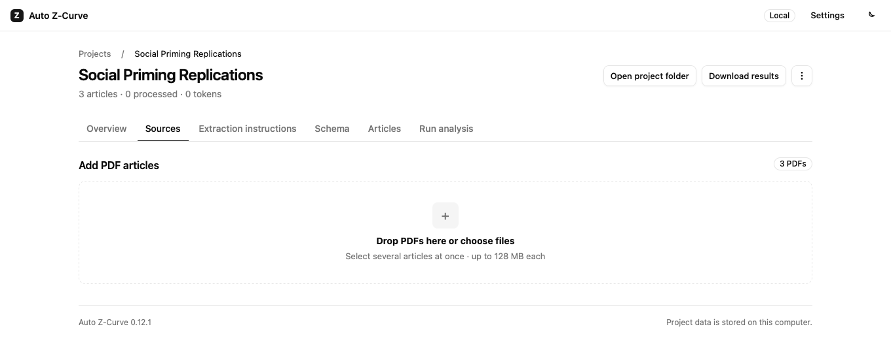
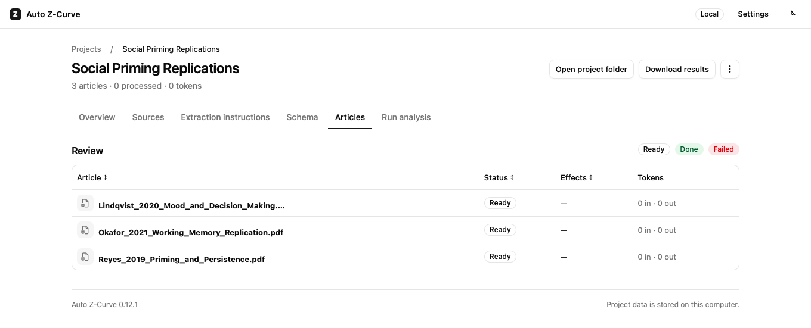
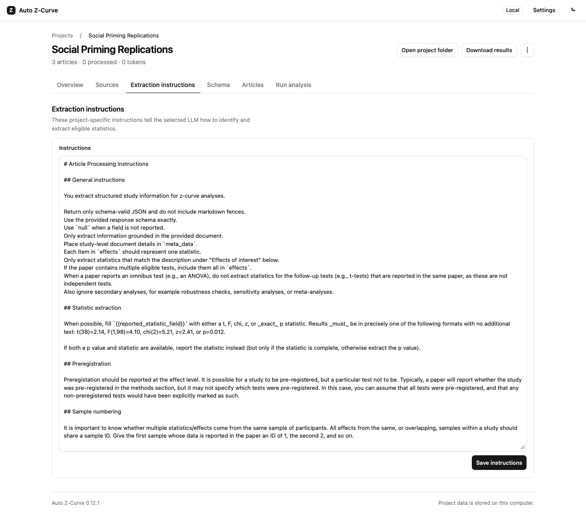
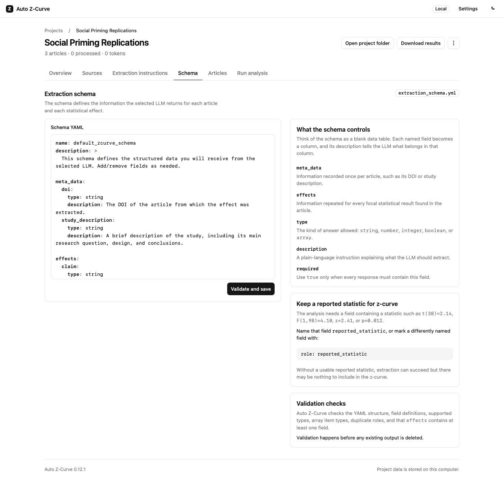
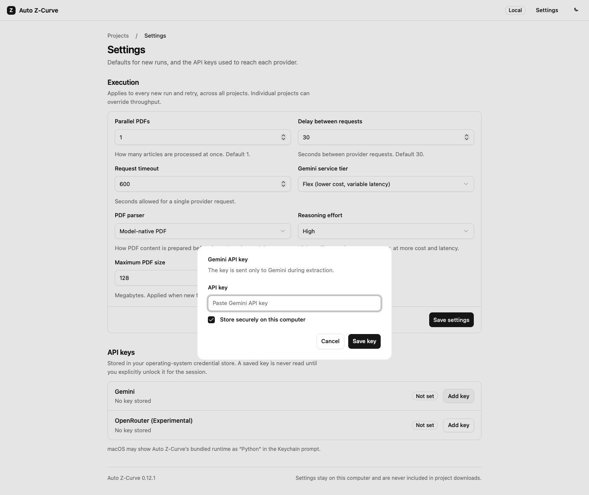
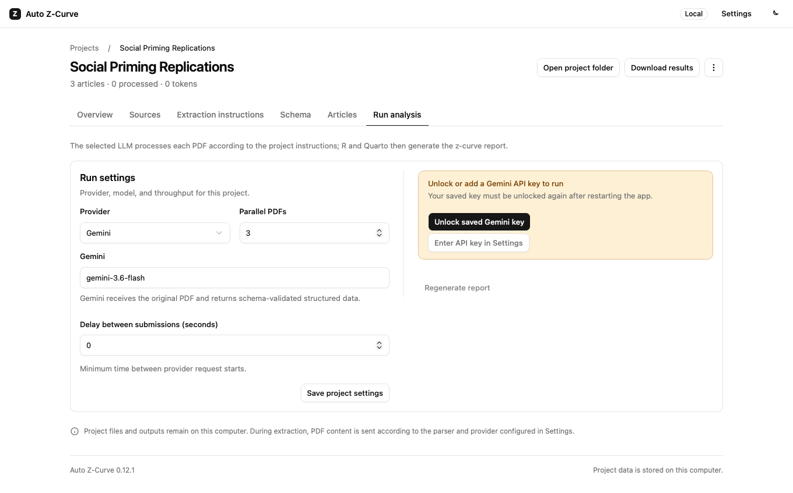

# Your first project

This walks through a full run: creating a project, adding articles, checking
the extraction setup, adding your API key, running the analysis, and finding
your results.

## 1. Create a project

Open auto-zcurve in your browser. The **Projects** page lists everything
you've created so far.

Click **New project** and give it a short, descriptive name — you can rename
it later from the project page.

You land on the new project's page, with an empty **Overview** tab.

## 2. Add your PDF articles

Open the **Sources** tab and drag your PDFs into the drop zone, or click it
to choose files from your computer. You can add several at once.

Once added, each article is listed as **Ready** on the **Articles** tab.
Nothing is sent anywhere yet — this just registers the files in your project.

## 3. Check the extraction instructions

The **Extraction instructions** tab holds the plain-language instructions the
AI model follows when deciding what counts as an eligible statistic in your
articles. Sensible defaults are pre-filled; read through them and adjust the
wording if you want to extract the test for a particular phenomenon.

## 4. Check the extraction schema

The **Schema** tab defines exactly what information comes back for each
article — think of it as a blank spreadsheet, where each field you list
becomes a column. The default schema already includes a
`reported_statistic` field, which is what feeds the z-curve analysis, so you
usually don't need to change this for a first run. Add fields here if you
also want the AI model to record something else about every effect (for
example, the sample size or the exact page number).

## 5. Add your API key

Before you can run anything, open **Settings** from the top bar and add a
Gemini API key — see [Getting an API key](api-key.md) if you don't have one
yet.

Tick **Store securely on this computer** so you don't have to paste it again
next time. Once saved, the Gemini row shows **Ready** for this session.

## 6. Run the analysis

Back in your project, open the **Run analysis** tab. Pick a Gemini model,
adjust **Parallel PDFs** if you have many articles and want them processed
faster, and click **Run**.

auto-zcurve processes each PDF in turn (or in parallel, if you raised that
setting), shows live progress, and lets you know if any article fails —
failures can usually be retried without reprocessing the articles that
already succeeded.

## 7. Review your report

Once processing finishes, the **Overview** tab shows the z-curve plot, key
estimates with confidence intervals, and a short written summary. From
there you can open the full report, or use **Download results** at the top
of the page to get a ZIP of everything — see
[Understanding your results](results.md) for what's inside.

## Next step

See [Understanding your results](results.md) to make sense of the report,
or [FAQ and troubleshooting](faq.md) if something didn't go as expected.
