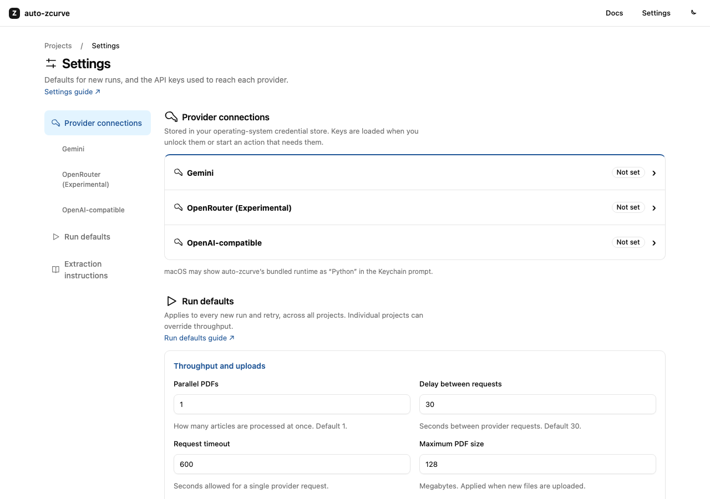
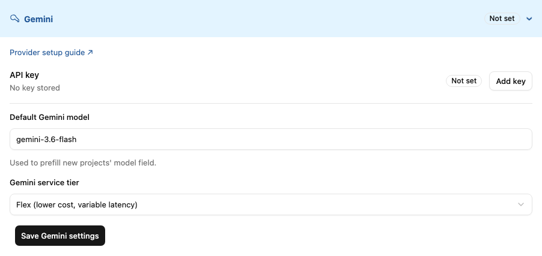
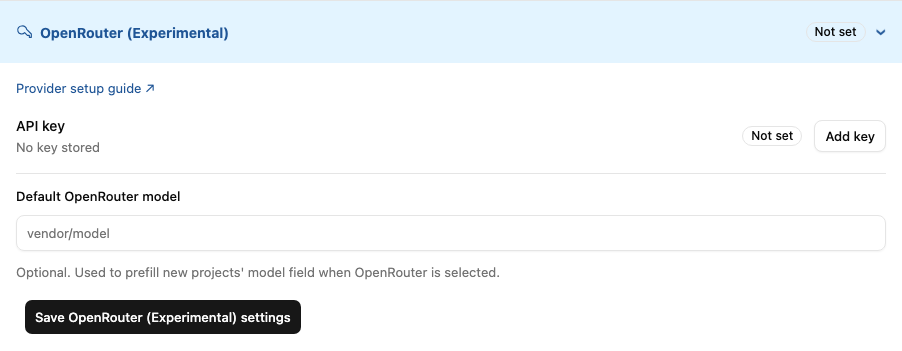
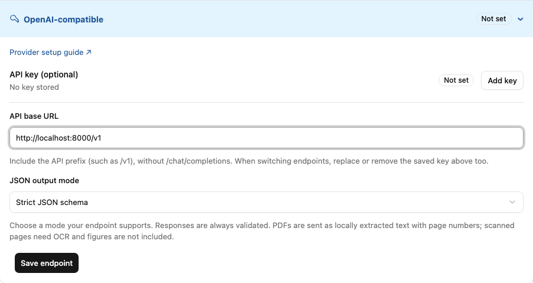
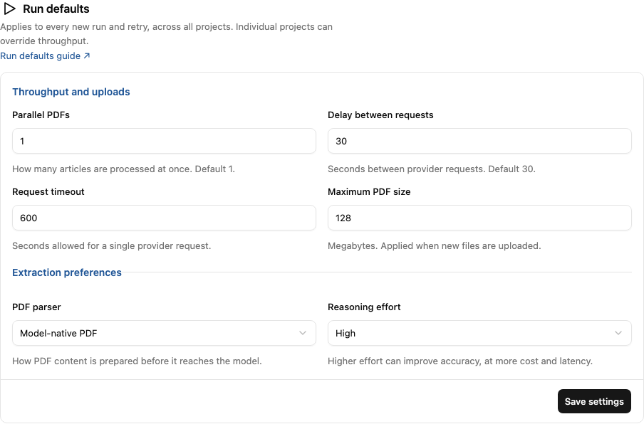
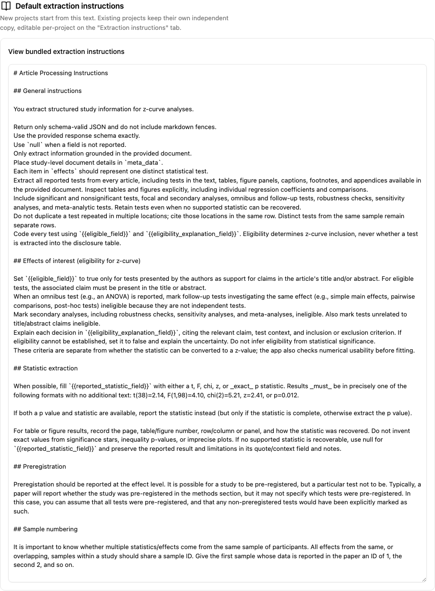

# Settings and providers

Open **Settings** in the top bar. The sidebar links to provider connections,
run defaults, and the bundled extraction instructions. On a narrow screen,
this navigation appears above the settings.

## Provider connections

Each provider has an expandable section. Click its heading to open or close
it, or use its sidebar link to jump there and open it. Several providers can
remain expanded at once.

API keys belong to the provider shown in that section. **Add key** opens a
password dialog; **Replace**, **Unlock**, and **Remove** appear when relevant.
See [API keys and privacy](api-key.md) for storage and access details.

### Gemini

Expand **Gemini** to manage its key, **Default Gemini model**, and
**Gemini service tier**. Save the model and tier with **Save Gemini settings**;
the API key dialog has its own save button.

The default model prefills the model field for new projects. A project can
choose another allowed Gemini model on **Run analysis**. Gemini receives the
original PDF. Its model choices are controlled by the installed `models.yml`.

### OpenRouter

Expand **OpenRouter (Experimental)** to manage its key and optional
**Default OpenRouter model**. Click **Save OpenRouter (Experimental) settings**
after changing the default.

Enter an exact model ID, such as the ID shown by your provider, on
**Run analysis**. There is no built-in OpenRouter model picker. The app checks
the live model catalog for structured-output and compatible input support
when you save or run. PDF processing uses OpenRouter's file-parser service.

### OpenAI-compatible

Expand **OpenAI-compatible** to connect a hosted or local server that supports
Chat Completions:

1. Enter its **API base URL**, including its API prefix. For example,
   `http://localhost:8000/v1`. Do not append `/chat/completions`, credentials,
   a query string, or a fragment.
2. Choose a **JSON output mode** supported by that server.
3. Click **Save endpoint**.
4. Use **Add key** if the server requires authentication. Keyless servers do
   not need an API key.
5. In a project's **Run analysis** section, choose **OpenAI-compatible** and
   enter the exact model ID served by that endpoint. Save the project settings
   or start the run.

The screenshot uses an example local address. Enter the address of your own
server and select an output mode it supports before saving.

| JSON output mode | What the app requests |
| --- | --- |
| Strict JSON schema | A `json_schema` response format with the extraction schema. |
| JSON object | A `json_object` response format, with the schema also in the prompt. |
| Prompt only | JSON requested in the prompt, without a response-format parameter. |

Every response is checked against the project's extraction schema, including
responses from prompt-only mode. The app does not query a model catalog for
these endpoints; the server must recognise the model ID you enter.

PDFs are converted locally to text with page numbers before being sent.
Figures are not included. Scanned PDFs need OCR first; a PDF with no
extractable text fails with an explanatory message.

There is one shared OpenAI-compatible connection for the app. Changing it
affects projects that use this provider. When switching servers, replace or
remove the old saved key as well so it is not used with the new endpoint.
The app's Gemini service tier and reasoning setting are not sent to this
endpoint.

## Run defaults

**Throughput and uploads** groups parallel PDFs, the delay between requests,
request timeout, and maximum PDF upload size. **Extraction preferences**
groups the PDF parser and reasoning setting. Click **Save settings** to save
these controls. Provider settings are saved separately and remain unchanged.

Projects can save their own parallel-request and delay values on **Run
analysis**. Model defaults may also prefill these fields. The PDF parser
control does not change the OpenAI-compatible provider's local text input.

## Default extraction instructions

Expand **View bundled extraction instructions** to read the starting text.
This view is read-only. Each project has an independent editable copy under
**Extraction instructions** in its left-hand navigation. See
[customising the extraction instructions](quickstart.md#3-check-the-extraction-instructions).

